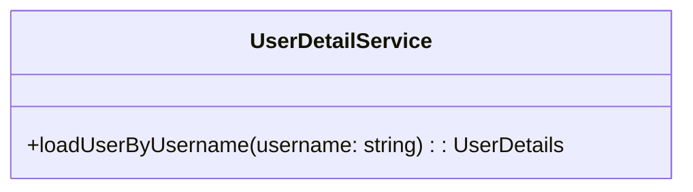

# Form Login 

Form 기반 로그인은 username/password 인증의 한 형식이다. 사용자가 보호된 자원을 요청할 때마다 Spring Security는 요청에 대한 인증을 체크한다. 요청이 인증/인가되지 않았다면 로그인 페이지로 리다이렉트 될 것이다. 스프링 시큐리티는 디폴트 로그인 폼을 제공한다. 로그인 폼을 커스텀할 수 있는데 username과 password 파라미터가 있어야 한다. 일단, 디폴트 폼 로그인을 사용할 것이다. 


로그인 과정을 정리해 보았다. 
* 사용자가 보호된 자원에 접근하면 로그인 폼으로 리다이렉트한다. 
* 사용자 "Sign in" 버튼을 클릭하면 "/login" URL로 폼을 서브밋 한다. 
* 스프링 시큐리티에서 UserDetailsService 객체의 loadUserByUsername() 메소드를 호출하여 사용자를 인증한다.
* loadUserByUsername() 메소드는 UserDetails 객체를 반환한다.
* 스프링 시큐리티가 반환된 UserDetails 객체의 password와 사용자가 입력한 password를 비교한다.
* 인증에 성공하면 지정된 페이지(디폴트 "/")로 리다이렉트한다.
* 인증에 실패하면 지정된 페이지로 리다이렉트한다. 


## 디폴트 로그인 폼 사용 
디폴트 로그인 폼을 사용하려면 구성 클래스에서 다음과 같이 사용한다. 
```java
import static org.springframework.security.config.Customizer.withDefaults;
// ... 생략 ... 
public SecurityFilterChain filterMain(HttpSecurity http) throws Exception {
  http.formLogin(withDefaults()); // SpringSecurity의 default login form이 표시된다. 
}    
```

### UserDetailsService 구현 


스프링 시큐리티가 지원하는 로그인 폼에서 사용자가 Sign in 버튼을 클릭하면 로그인이 진행된다.  디폴트 로그인 URL인 "/login"으로 로그인을 요청한다. 스프링 시큐리티 내부적으로 사용자를 인증하기 위해서 UserDetailsService의 loadUserByUsername() 메소드를 호출한다.

사용자를 인증하기 위해서 loadUserByUsername() 메소드 내에서 사용자를 인증하고 UserDetails 객체를 반한한다. 

UserDetailsService 인터페이스는 다음과 같이 정의되어 있다. UserDeatilsService의 loadUserByUsername() 메소드를 구현하면 된다. 

```java
public abstract interface UserDetailsService {
  public abstract  loadUserByUsername(java.lang.String username) throws UsernameNotFoundException;
}
```


DB에서 사용자 정보를 조회하여 UserDetails를 반환해야 하지만 간단하게 구현하기 위해서 DB에서 조회하는 코드는 생략했다. 


```java
package com.jirepos.formlogin.service;

import org.springframework.security.core.authority.SimpleGrantedAuthority;
import org.springframework.security.core.userdetails.User;
import org.springframework.security.core.userdetails.UserDetails;
import org.springframework.security.core.userdetails.UserDetailsService;
import org.springframework.security.core.userdetails.UsernameNotFoundException;
import org.springframework.security.crypto.password.PasswordEncoder;
import org.springframework.stereotype.Service;

import com.jirepos.formlogin.enums.Role;

import lombok.RequiredArgsConstructor;

@Service
// private final로 정의된 멤머를 주입하기 위해 사용 
@RequiredArgsConstructor
public class FormLoginUserDetailServiceImpl implements UserDetailsService  {

    // Java Configuration 클래스에서 정의한 Encoder를 주입받는다.
    private final PasswordEncoder passwordEncoder;

    // 이 메소드에서 사용자 정보를 조회하고  UserDtails 인스턴스를 생성한다.
    @Override
    public UserDetails loadUserByUsername(String username) throws UsernameNotFoundException {
        return createUser(username);
    }

    /** UserDetails 인스턴스를 생성한다. */
    private UserDetails createUser(String username) {
        // DB에서 사용자 정보를 조회하여 사용자 정보가 있는지 확인해야 한다. 
        // ADMIN ROLE 설정 
        SimpleGrantedAuthority authority = new SimpleGrantedAuthority(Role.ADMIN.getValue());  
        return User.builder()
                .username(username)
                // DB에서 조회한 패스워드 설정 
                // 지금은 DB에서 조회하지 않으므로 임의의 패스워드를 PasswordEncoder를 사용하여 
                // 암호화하여 설정한다.
                .password( passwordEncoder.encode("1234"))
                .authorities(authority)
                .build();
    }
}///~
```


**로그인 사용자 정보** 
로그인 폼에서 입력한 username이 loadUserByUsername() 메소드의 파라미터로 전달된다. 이 파라미터를 가지고 사용자 정보를 DB에서 조회하여 UserDetails 객체를 생성하여 반환한다. 스프링시큐리티가 제공하는 org.springframework.security.core.userdetails.User 클래스의 Builder를 통하여 UserDetails 객체를 생성한다. 


**password** 
패스워드는 보통 DB에 저장이되는데 복호화가 불가능한 암호화를 사용하여 저장한다. 스프링 시큐리티에서는 PasswordEncoder 인터페이스를 제공한다. 이전에 우리는 BCryptPasswordEncoder를 사용하였다. 사용자가 입력한 패스워드는 스프링시큐리티가  PasswordEncoder를 사용하여 암호화하여 보관하고 있다.  이 것을 DB에 저장된 암호화된 패스워드와 비교하여 인증을 수행한다.  즉, DB에 저장된 패스워드의 암호화 방식이 스프링시큐리티와 동일한 방식이어야 한다. 

```java
@Bean
PasswordEncoder passwordEncoder() {
    // BCrypt가 가장 많이쓰이는 해싱 방법
    // 패스워드 인크립트할 때 사용
    return new BCryptPasswordEncoder();
}
```

### 로그인 후 이동 URL 
사용자 인증에 성공하면 스프링시큐리티는 "/"로 리다이렉트한다. 이것을 처리할 메소드와 페이지를 만들어야 한다. main 페이지를 반환하는 메소드를 다음과 같이 작성했다. 

```java
@Controller
@Slf4j
public class FormLoginController {
    @GetMapping("/")
    public String main() {
        return "main.mustache";
    }
}
```
templates 폴더 아래에 main.mustache 파일을 다음과 같이 작성했다. 
```html
<!DOCTYPE html>
<html lang="en">
<body>
  <h1>Main Page after Login</h1>
</body>
</html>
```
이제 로그인을 다시 하면 Main Page를 볼 수 있을 것이다. 


### 로그인 실패 시 URL 
로그인이 실패하면 "/login?error"로 리다이렉트되어 다시 로그인 폼이 보이게 될 것이다. 

## 폼로그인 커스터마이징 
스프링 시큐리티가 제공하는 로그인 폼을 사용하지 않고 formLogin()을 사용하여 커스텀할 수 있다. 먼저 csrf를 dsiable 시켜야 한다. 

```java
http.csrf(customizer -> customizer.disable()); // csrf 사용하지 않음
```
formLogin() 메소드를 다음과 같이 작성한다. loingPage() 메소드를 사용하여 로그인 폼을 보여줄 URL을 지정한다. loginProcessingUrl() 메소드를 사용하여 로그인 처리 URL을 지정한다. Spring Security 디폴트 처리 URL은 "/perform_login"이다. 임의로 URL을 지정해도 된다. 


```java
    http.formLogin(formLoginCustomizer -> formLoginCustomizer
          .loginPage("/formlogin").permitAll(true) // default loing url과 동일한 url 사용하면 안된다. 
          // 로그인 처리 URL, default URL은 /login, loginPage()를 수정했으면 이것을 지정해야 함
          // username, password가 전달될 url 
          .loginProcessingUrl("/login_proc").permitAll(true) 
    );
```    

loginProcessingUrl()에서 지정한 url을 action에 설정한다. 

```html
<form action="login_proc" method="POST">
  <label for="username">Username:</label>
  <input type="text" id="username" name="username" required><br><br>
  <label for="password">Password:</label>
  <input type="password" id="password" name="password" required><br><br>
  <input type="submit" value="Login">
</form>
```  

로그인 페이지를 반환할 컨트롤러 메소드를 작성한다. 
```java
/** 사용자 정의 로그인 페이지 */
@GetMapping("/formlogin")
public String login() {
    return "formlogin.mustache";
}
```    

**로그인 성공 또는 실패 페이지** 
로그인 성공 후에 도착할 페이지를 지정한다. defaultSuccessUrl() 메소드를 사용하여 지정한다.지정하지 않으면 요청했던 url로 리다이렉트된다. 
```java
.defaultSuccessUrl("/home", true).permitAll(true)  // 로그인 성공 후에 랜딩 페이지
```
로그인 실패 시 도착할 페이지를 지정하려면 failureUrl() 메소드를 사용한다.
```java
.failureUrl("/login-fail") // 인증 실패 시 url 
```

## 로그인 사용자 정보 
로그인을 통해 인증된 유저 정보는 Security Context Holder에 저장되며 아래와 같이 가져올 수 있다. 
```java
// import org.springframework.security.core.annotation.AuthenticationPrincipal;
Object obj = SecurityContextHolder.getContext().getAuthentication().getPrincipal();
UserDetails user = (UserDetails) obj;
log.debug("user: {}", user.getUsername());
System.out.println("user: " + user.getUsername());
```