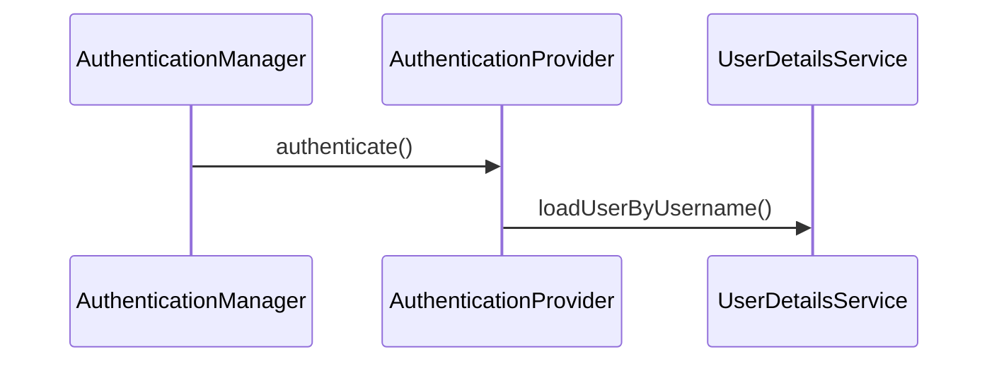
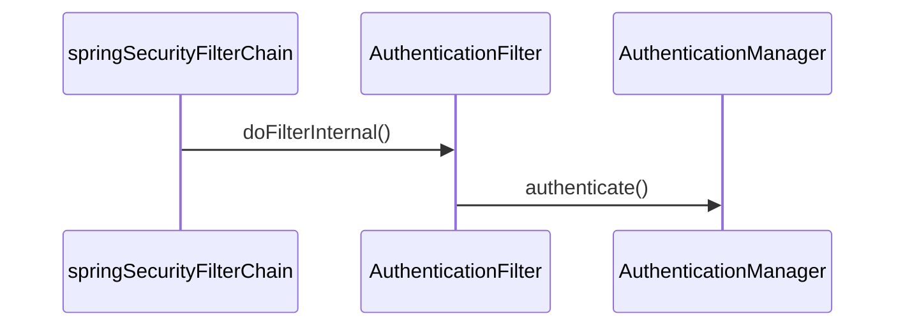
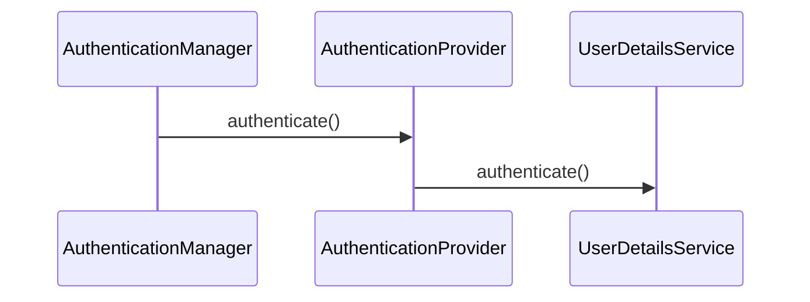
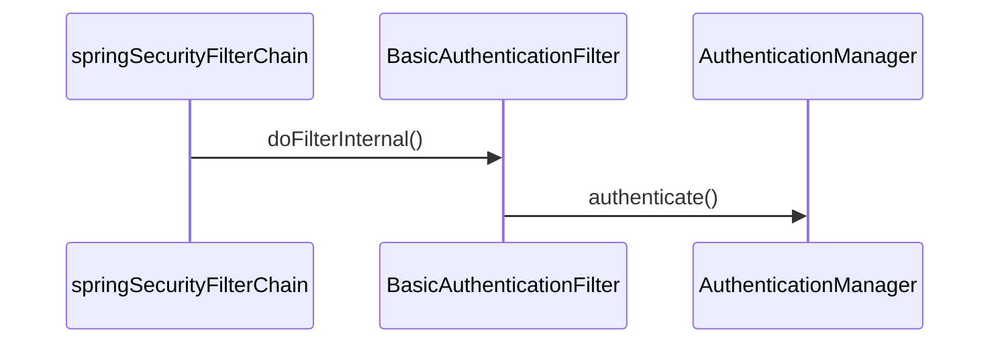
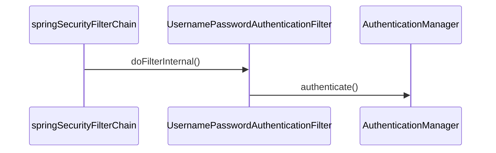
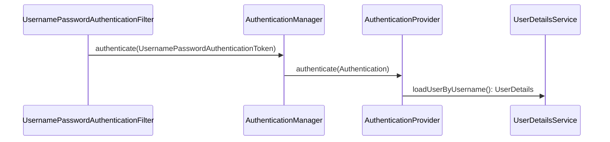

# Test

```mermaid
sequenceDiagram
    AuthenticationManager ->>AuthenticationProvider : authenticate()
    AuthenticationProvider->>UserDetailsService : loadUserByUsername()

```
## 인증과정 의사코드 흐름

```mermaid
sequenceDiagram
    springSecurityFilterChain ->> AuthenticationFilter : doFilterInternal()
    AuthenticationFilter ->> AuthenticationManager: authenticate()
```    

```mermaid
sequenceDiagram
    AuthenticationManager ->> AuthenticationProvider : authenticate()
    AuthenticationProvider ->> UserDetailsService: authenticate()
```    

## Basic Authentication 

```mermaid
sequenceDiagram
    springSecurityFilterChain ->> BasicAuthenticationFilter : doFilterInternal()
    BasicAuthenticationFilter ->> AuthenticationManager: authenticate()
```    

```mermaid
sequenceDiagram
    AuthenticationManager ->> AuthenticationProvider : authenticate()
    AuthenticationProvider ->> UserDetailsService: authenticate()
```    

## Form Login 

```mermaid
sequenceDiagram
    springSecurityFilterChain ->> UsernamePasswordAuthenticationFilter : doFilterInternal()
    UsernamePasswordAuthenticationFilter ->> AuthenticationManager: authenticate()
```

ssss

```mermaid
sequenceDiagram
    UsernamePasswordAuthenticationFilter ->>AuthenticationManager : authenticate(UsernamePasswordAuthenticationToken)
    AuthenticationManager ->>AuthenticationProvider : authenticate(Authentication)
    AuthenticationProvider->>UserDetailsService : loadUserByUsername(): UserDetails
```
